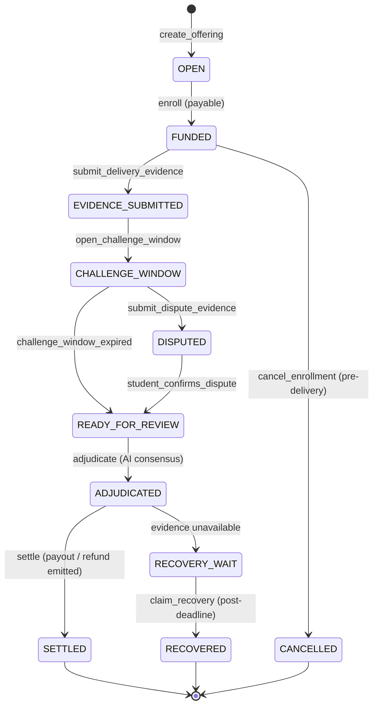

# SyllabusBond — Proof Plan

## 1. Core Judgment & Financial Consequence

- **Core Judgment**: Did the organizer deliver the educational offering in conformance with the locked syllabus commitment (sessions, topics, duration, instructor, and completion)?
- **Consequence**: Escrow release or refund of the student's tuition deposit.
- **Why GenLayer is Indispensable**: A centralized platform can be biased or unresponsive to nuance in educational delivery disputes. A normal smart contract cannot inspect multi-source text evidence or evaluate qualitative syllabus coverage. GenLayer's decentralized LLM consensus provides neutral, trustless, and nuanced evaluation of pedagogical delivery.

## 2. Actors & Authorization Model

| Role | Authorized Address Source | Permissions |
|------|---------------------------|-------------|
| **Organizer** | `gl.message.sender_address` during `create_offering` | Commit offering terms, submit delivery evidence, claim organizer payout, claim recovery after deadline |
| **Student** | `gl.message.sender_address` during `enroll` | Fund enrollment via payable transaction, submit dispute evidence during challenge window, cancel before delivery deadline, claim refund, claim recovery after deadline |
| **Any Party** | `gl.message.sender_address` matching organizer OR student | Trigger adjudication, execute final settlement, claim recovery |
| **Unauthorized Caller** | Any other address | Reverted with `ORGANIZER_ONLY`, `STUDENT_ONLY`, or `PARTY_ONLY` |

## 3. Complete State Machine

## 4. Value Custody & Conservation Flow

- **Deposit**: `enroll` requires exact attached value `gl.message.value == offering_fee`.
  - `total_received += fee`
  - `total_held += fee`
- **Settlement**:
  - `DELIVERED`: Payout 100% to Organizer, 0% to Student.
  - `MATERIALLY_REDUCED`: Payout 50% (`fee // 2`) to Organizer, Refund 50% + remainder (`fee - (fee // 2)`) to Student.
  - `NOT_DELIVERED`: Payout 0% to Organizer, Refund 100% to Student.
  - `total_held -= fee`, `total_paid += organizer_payout`, `total_refunded += student_refund`.
- **Conservation Invariant**:
  $$\text{total\_received} = \text{total\_held} + \text{total\_paid} + \text{total\_refunded}$$
  $$\forall \text{enrollment: } \text{organizer\_payout} + \text{student\_refund} = \text{funded\_fee}$$

## 5. Evidence Identity, Digest Commitment & Case Binding

Every evidence item stored in the contract is bound to:
1. `enrollment_id` (case identifier)
2. `submitter` address
3. `evidence_type` (`TERMS`, `DELIVERY`, `DISPUTE`)
4. Immutable URL (`https://arweave.net/...` or `https://ipfs.io/ipfs/...`)
5. Committed `sha256:` digest
6. Anti-reuse index: `digest_claim_index[digest] = enrollment_id + 1`

When fetched in `adjudicate()`, the contract recalculates `sha256(raw_bytes)` and compares with the committed digest. Mismatches immediately trigger the `EVIDENCE_UNAVAILABLE` safe fallback.

## 6. Adversarial Transaction Matrix

| Test Case | Actor | Action | Expected Result |
|-----------|-------|--------|-----------------|
| **Happy Path Delivery** | Organizer & Student | Create -> Enroll -> Deliver -> Adjudicate -> Settle | State `SETTLED`, 100% payout to Organizer |
| **Material Reduction Split** | Organizer & Student | Create -> Enroll -> Deliver (partial) -> Adjudicate (`MATERIALLY_REDUCED`) -> Settle | State `SETTLED`, 50% to Organizer, 50% + rem to Student |
| **Total Breach Refund** | Organizer & Student | Create -> Enroll -> Adjudicate (`NOT_DELIVERED`) -> Settle | State `SETTLED`, 100% refund to Student |
| **Wrong Caller Enrollment** | Impersonator | Attempting to claim/modify another student's enrollment | Revert `STUDENT_ONLY` |
| **Zero / Insufficient Value** | Student | Calling `enroll` with wrong wei value | Revert `EXACT_FEE_REQUIRED` |
| **Duplicate Enrollment** | Student | Enrolling twice in the same offering | Revert `ALREADY_ENROLLED` |
| **Evidence Digest Reuse** | Attacker | Submitting previously used delivery/dispute digest | Revert `DIGEST_ALREADY_USED` |
| **Early Adjudication** | Organizer | Calling `adjudicate` during active challenge window | Revert `CHALLENGE_WINDOW_ACTIVE` |
| **Double Settlement** | Either Party | Calling `settle` twice on already settled case | Revert `NOT_READY_FOR_SETTLEMENT` |
| **Unilateral Recovery Timeout** | Either Party | Calling `claim_recovery` before recovery deadline | Revert `RECOVERY_DEADLINE_NOT_MET` |
| **Post-Deadline Recovery** | Either Party | Calling `claim_recovery` after recovery deadline | State `RECOVERED`, pre-committed split transferred |
